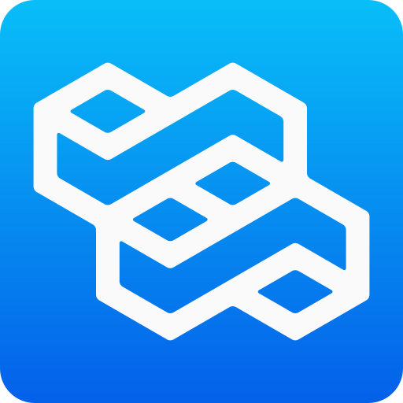
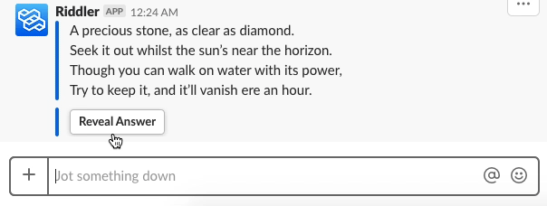

# riddler [](https://github.com/cedricium/riddler/releases) [](https://github.com/cedricium/riddler/blob/master/LICENSE.md) [](https://github.com/cedricium/riddler/issues) 
> _I am a bot of few words, but many riddles._

**riddler** is a Slack app that delivers riddles on command. By typing `/riddler`, **riddler** will respond with a message only visible to you containing a riddle and a button to reveal the answer. With hundreds of riddles at your disposal, there's no excuse to ever be bored at work again!

Special thanks to CJS from the Noun Project for providing the abstract logo.

## Install on Slack Now
<a href="https://slack.com/oauth/authorize?client_id=419464847798.417895979188&scope=commands"></a>

## Getting Started

### Installing
Before installing, you will need:
- `node` version >= 8
- `npm`
- `git`

Once you have those installed:

```shell
# Clone this repository
$ git clone https://github.com/cedricium/riddler

# Go into the repository
$ cd riddler/

# Install the dependencies
$ npm install
```

### Developing
Once you have the dependencies installed, you're ready to begin developing. Use the `start` script to start the Express server:

```shell
$ npm start
```


## Demo


## Contributing
Your contributions are always welcome! See an issue you want to tackle or have an idea for a feature you'd like implemented? Just open a pull-request with a short explanation of the changes and I'd be happy to review it.

## License
You are free to copy, modify, and distribute **riddler** with attribution under the terms of the MIT license. See the [LICENSE](LICENSE.md) file for details.
